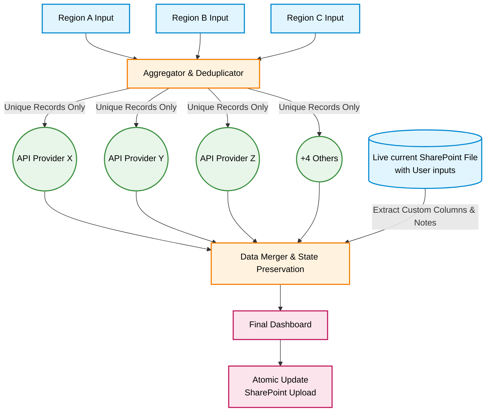

# Logistics Data Orchestrator

> **Note:** Anonymized snapshot of a production enterprise ETL pipeline. Proprietary credentials and internal routing logic are removed.

A concurrent, stateful ETL orchestrator for global data providers. Seamlessly integrates 7 APIs using advanced rate-limit evasion, dynamic payload parsing, and atomic SharePoint state management.

**Stack & Concepts:** Python 3.10+ | Pandas (Data Wrangling) | `concurrent.futures` (Multithreading) | REST APIs & OAuth2/JWT | OpenPyXL (Automated Reporting) | ETL Architecture | Schema Normalization | OneDrive/SharePoint Sync.

## Business Impact

* **Single Source of Truth:** Superseded the primary corporate enterprise system due to superior data accuracy and enriched context. It now serves as the central operational dashboard.
* **110+ Daily Active Users:** Empowers cross-functional teams to dynamically add columns and share data in real-time.
* **Zero Data Loss Automation:** Eliminated manual tracking. Seamlessly merges fresh API data with existing human comments without overwriting user state.

## Engineering Highlights

| Challenge | Architectural Solution | 
| :--- | :--- | 
| **Rate Limits & WAF Evasion** | Randomized payload queues, exponential backoff, and jitter across threads to bypass call limits. | 
| **Stateful Data Merging** | Parses live SharePoint XML to extract custom user columns/colors, merging them with fresh API data via `pandas`. | 
| **I/O Bottlenecks** | Uses `concurrent.futures.ThreadPoolExecutor` to poll 7 APIs simultaneously, cutting execution time. | 
| **Multi-Auth Complexity** | Natively handles diverse auth: `.pfx` certs, RSA decryption for JWTs (MSC), and auto-refreshing OAuth2. | 
| **Scalable OOP Design** | Built on a `BaseCarrier` abstract class enforcing strict contracts for HTTP sessions, retries, and JSON parsing. | 

## System Architecture

The core logic revolves around minimizing API costs via deduplication and safely re-merging stateful data.



## Project Structure
```text
├── carriers/                 # Integration Layer (Abstract Base Class & API Implementations)
│   ├── base_carrier.py       # Core OOP logic (Auth, Retries, JSON Parsing, Exponential Backoff)
│   ├── provider_alpha.py     .
│   ├── provider_beta.py      
│   ├── provider_delta.py     
│   ├── provider_epsilon.py   
│   ├── provider_gamma.py     
│   ├── provider_omega.py     
│   └── provider_zeta.py      
├── certs/                    # Secure certificate storage
│   └── provider_cert.pfx     # Local certs
├── utils/                    # Core Business & Processing Logic
│   ├── __init__.py           
│   ├── constants.py          # Mappings and globally shared variables
│   ├── data_cleaner.py       # Pandas data wrangling & cross-departmental deduplication
│   ├── excel_writer.py       # Openpyxl dynamic schema generation & styling
│   ├── logger.py             # Rotating log configuration for production
│   └── sharepoint.py         # Atomic OS file ops & SharePoint state extraction
├── .env.example              # Environment variables template
├── .gitignore                
├── config.py                 # Environment configuration and pipeline routing
├── main.py                   # Multi-threaded orchestrator entry point
└── requirements.txt          
```
